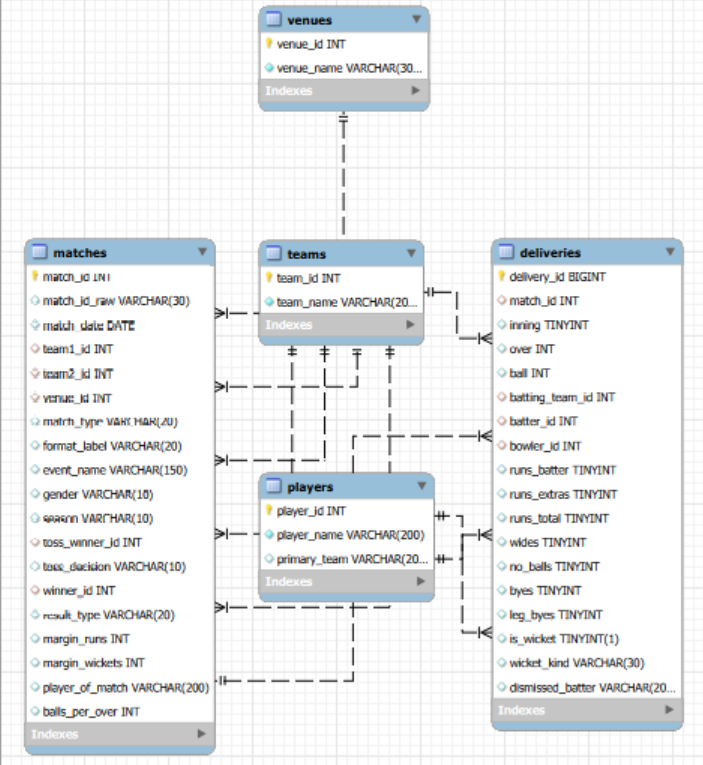
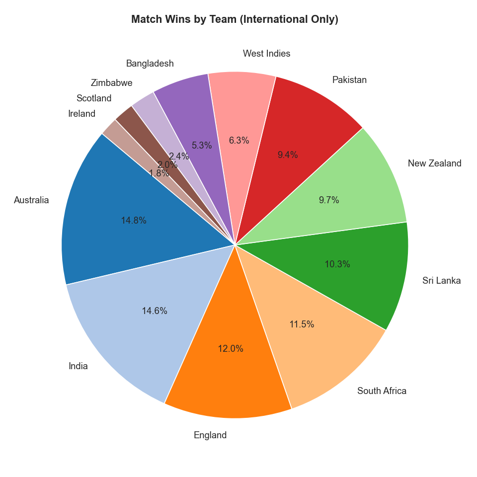
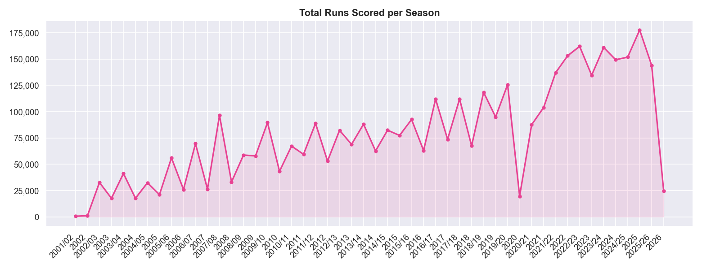
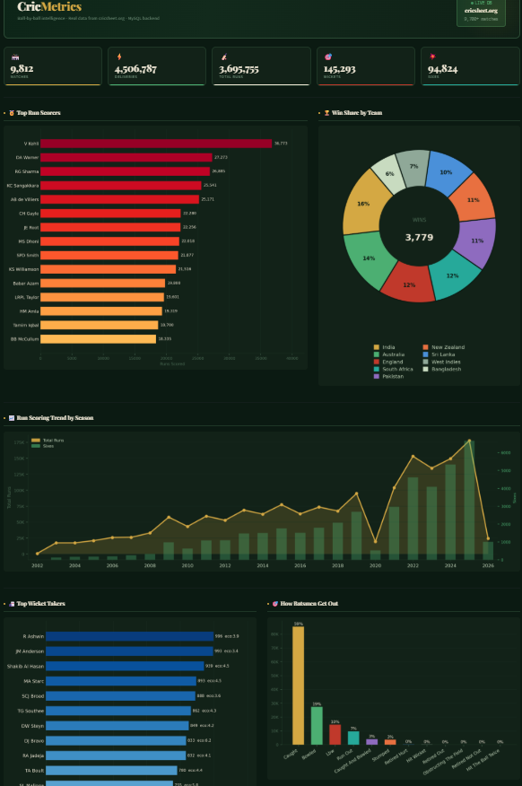
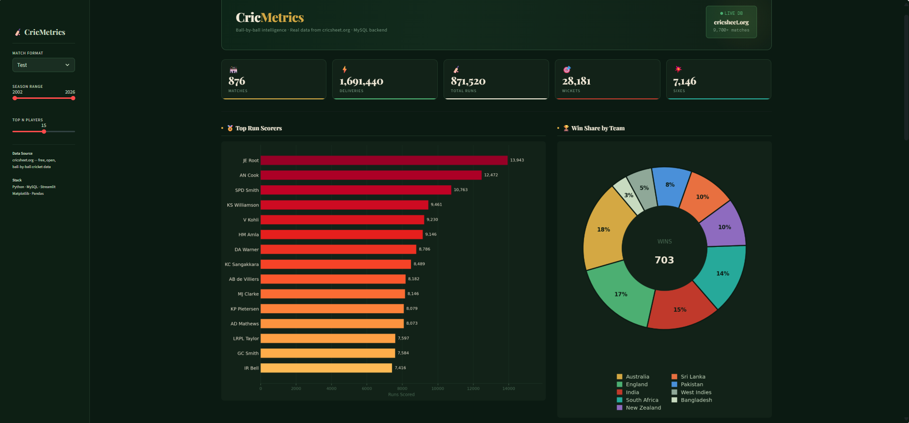

# 🏏 Cricket Analytics — End-to-End Data Engineering Project

> **Python ETL → MySQL → SQL Analytics → Jupyter → Streamlit Dashboard**

---

## 📌 Overview

Cricket generates massive volumes of ball-by-ball data. This project builds a **complete data engineering pipeline** to transform raw match data into actionable insights.

It includes:

* Data ingestion from real-world sources
* Transformation into a structured relational database
* Analytical SQL queries
* Visual analysis using Python
* Interactive dashboard using Streamlit

---

## 🏗️ Architecture

```
Raw Data (Cricsheet JSON)
        ↓
ETL Pipeline (Python)
        ↓
MySQL Database (cricket_db)
        ↓
SQL Analytics
        ↓
Jupyter Analysis
        ↓
Streamlit Dashboard
```

---

## ⚙️ Tech Stack

* **Language:** Python
* **ETL:** Pandas, NumPy
* **Database:** MySQL
* **Querying:** SQL
* **Visualization:** Matplotlib, Seaborn
* **Dashboard:** Streamlit

---

## 📊 Key Features

✔ Processes **9,000+ matches and 4.5M+ deliveries**
✔ Optimized handling of large datasets (deliveries stored directly in MySQL)
✔ 12+ analytical SQL queries
✔ Interactive dashboard with filters and KPIs
✔ Clean and modular data pipeline

---

## 📸 Project Screenshots

### 🧩 Database & Queries



---

### 📊 Analysis (Jupyter)




---

### 📈 Dashboard




---

## 🗄️ Database Schema

* **teams**
* **players**
* **matches**
* **venues**
* **deliveries** (fact table)

> ⚠️ The `deliveries` table (~4.5M rows) is stored directly in MySQL and not exported as CSV for efficiency.

---

## 🚀 How to Run

### 1. Install dependencies

```bash
pip install -r requirements.txt
```

### 2. Run ETL pipeline

```bash
python etl.py
```

### 3. Run analysis (optional)

```bash
cd notebooks
jupyter notebook
```

### 4. Run dashboard

```bash
cd dashboard
streamlit run dashboard.py
```

---

## 📁 Project Structure

```
cricket_de_project/
│
├── etl.py
├── requirements.txt
├── README.md
│
├── data/
│   ├── teams.csv
│   ├── players.csv
│   ├── matches.csv
│   └── venues.csv
│
├── sql/
│   └── database.sql
│
├── notebooks/
│   └── cricket_analysis.ipynb
│
├── dashboard/
│   └── dashboard.py
│
├── screenshots/
│   ├── mysql/
│   ├── notebook/
│   └── dashboard/
```

---

## 🧠 Design Decisions

* Large datasets (deliveries) are stored directly in MySQL instead of CSV
* Hybrid storage (CSV + DB) improves debugging and efficiency
* Modular pipeline ensures scalability

---

## 🚀 Potential Extensions

- Scale the pipeline using distributed processing (e.g., Apache Spark)
- Integrate real-time data ingestion for live match analytics
- Deploy the system on cloud platforms (AWS/GCP)
- Extend analytics with predictive models for player and match performance

---

## 💡 Key Learnings

* End-to-end data pipeline design
* SQL optimization and analytics
* Handling large datasets efficiently
* Building production-style dashboards

---

## 👨‍💻 Author

**Ayush**

---

## ⭐ If you like this project, give it a star!
